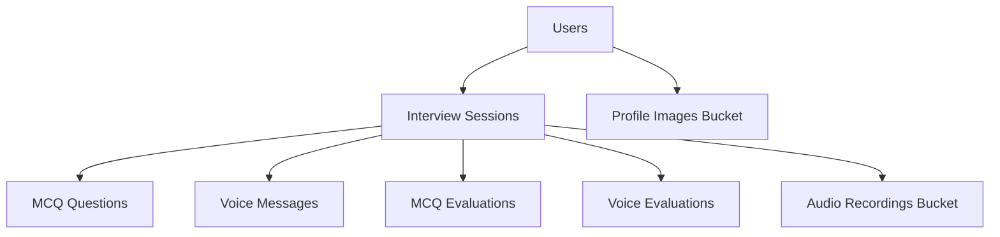

# Complete Appwrite Schema Reference

This document provides a comprehensive overview of all Appwrite collections and storage buckets used in the Mock Interview project.

## Project Configuration

- **Appwrite Endpoint**: https://cloud.appwrite.io/v1
- **Project ID**: 680d2c3d00181a48c844
- **Database ID**: 687765bf0013ce99c541

## Collections Schema

### 1. Users Collection (`68777f1300324ee21d1e`)

**Purpose**: Store user profile information and authentication details

| Field             | Type     | Required | Description                                   |
| ----------------- | -------- | -------- | --------------------------------------------- |
| `$id`             | String   | Yes      | User ID (matches Firebase Auth UID)           |
| `name`            | String   | Yes      | User's display name                           |
| `email`           | String   | Yes      | User's email address                          |
| `photoUrl`        | String   | No       | Profile image URL                             |
| `provider`        | String   | Yes      | Auth provider ('email', 'google', 'facebook') |
| `totalInterviews` | Integer  | Yes      | Total number of interviews completed          |
| `averageScore`    | Double   | Yes      | Average score across all interviews           |
| `voiceInterviews` | Integer  | Yes      | Number of voice interviews completed          |
| `mcqInterviews`   | Integer  | Yes      | Number of MCQ interviews completed            |
| `phone`           | String   | No       | User's phone number                           |
| `preferences`     | Object   | No       | User preferences and settings                 |
| `$createdAt`      | DateTime | Auto     | Account creation timestamp                    |
| `$updatedAt`      | DateTime | Auto     | Last update timestamp                         |

**Model**: `UserModel` in `/lib/features/auth/data/models/user_model.dart`

---

### 2. Interview Sessions Collection (`interview_sessions`)

**Purpose**: Unified storage for all interview sessions (MCQ and Voice)

| Field             | Type     | Required | Description                                 |
| ----------------- | -------- | -------- | ------------------------------------------- |
| `$id`             | String   | Yes      | Unique session identifier                   |
| `userId`          | String   | Yes      | Reference to user who took the interview    |
| `jobRole`         | String   | Yes      | Target job role for the interview           |
| `interviewType`   | String   | Yes      | Type of interview ('mcq' or 'voice')        |
| `difficulty`      | String   | Yes      | Difficulty level ('easy', 'medium', 'hard') |
| `category`        | String   | Yes      | Interview category/domain                   |
| `totalQuestions`  | Integer  | Yes      | Total number of questions in the session    |
| `timePerQuestion` | Integer  | No       | Time allocated per question (seconds)       |
| `isCompleted`     | Boolean  | Yes      | Whether the interview is completed          |
| `passed`          | Boolean  | No       | Whether the user passed the interview       |
| `score`           | Double   | No       | Final score achieved                        |
| `percentage`      | Double   | No       | Score as percentage                         |
| `startedAt`       | DateTime | Yes      | When the interview was started              |
| `completedAt`     | DateTime | No       | When the interview was completed            |
| `duration`        | Integer  | No       | Total time taken (seconds)                  |

**Model**: `UnifiedInterviewSession` in `/lib/core/models/unified_interview_session.dart`

---

### 3. MCQ Questions Collection (`mcq_questions`)

**Purpose**: Store individual MCQ questions and user responses

| Field           | Type    | Required | Description                          |
| --------------- | ------- | -------- | ------------------------------------ |
| `$id`           | String  | Yes      | Unique question identifier           |
| `sessionId`     | String  | Yes      | Reference to interview session       |
| `questionNo`    | Integer | Yes      | Question number in the session       |
| `question`      | String  | Yes      | The question text                    |
| `options`       | String  | Yes      | JSON-encoded array of answer options |
| `correctAnswer` | String  | Yes      | The correct answer                   |
| `userAnswer`    | String  | No       | User's selected answer               |
| `isCorrect`     | Boolean | No       | Whether user answered correctly      |
| `score`         | Double  | No       | Points awarded for this question     |
| `explanation`   | String  | Yes      | Explanation of the correct answer    |
| `difficulty`    | String  | Yes      | Question difficulty level            |
| `category`      | String  | Yes      | Question category                    |
| `topic`         | String  | Yes      | Specific topic of the question       |
| `jobRole`       | String  | Yes      | Relevant job role                    |

**Model**: `McqQuestionModel` in `/lib/core/models/mcq_question_model.dart`

---

### 4. Voice Messages Collection (`voice_messages`)

**Purpose**: Store conversation messages in voice interviews

| Field            | Type     | Required | Description                              |
| ---------------- | -------- | -------- | ---------------------------------------- |
| `$id`            | String   | Yes      | Unique message identifier                |
| `sessionId`      | String   | Yes      | Reference to interview session           |
| `messageType`    | String   | Yes      | Type of message ('ai', 'user', 'system') |
| `content`        | String   | No       | Message content/transcript               |
| `timestamp`      | DateTime | Yes      | When the message was created             |
| `sequenceNumber` | Integer  | Yes      | Order of message in conversation         |

**Model**: `VoiceMessageModel` in `/lib/core/models/voice_message_model.dart`

---

### 5. MCQ Evaluations Collection (`mcq_evaluations`)

**Purpose**: Store comprehensive evaluation results for MCQ interviews

| Field            | Type     | Required | Description                      |
| ---------------- | -------- | -------- | -------------------------------- |
| `$id`            | String   | Yes      | Unique evaluation identifier     |
| `sessionId`      | String   | Yes      | Reference to interview session   |
| `totalQuestions` | Integer  | Yes      | Total questions in the interview |
| `correctAnswers` | Integer  | Yes      | Number of correct answers        |
| `finalScore`     | Double   | Yes      | Final calculated score           |
| `timeTaken`      | Integer  | No       | Total time taken (seconds)       |
| `$createdAt`     | DateTime | Auto     | Evaluation creation timestamp    |

**Model**: `McqEvaluationModel` in `/lib/core/models/mcq_evaluation_model.dart`

---

### 6. Voice Evaluations Collection (`voice_evaluations`)

**Purpose**: Store AI-generated evaluations for voice interviews

| Field                | Type     | Required | Description                    |
| -------------------- | -------- | -------- | ------------------------------ |
| `$id`                | String   | Yes      | Unique evaluation identifier   |
| `sessionId`          | String   | Yes      | Reference to interview session |
| `feedback`           | String   | No       | AI-generated feedback text     |
| `communicationScore` | Double   | No       | Score for communication skills |
| `contentScore`       | Double   | No       | Score for content quality      |
| `overallScore`       | Double   | No       | Overall interview score        |
| `aiCorrectAnswers`   | Integer  | No       | AI-assessed correct answers    |
| `totalQuestions`     | Integer  | No       | Total questions asked          |
| `finalScore`         | Double   | No       | Final calculated score         |
| `percentage`         | Double   | No       | Score as percentage            |
| `passed`             | Boolean  | No       | Whether the user passed        |
| `sessionComplete`    | Boolean  | No       | Whether evaluation is complete |
| `completedAt`        | DateTime | No       | When evaluation was completed  |
| `$createdAt`         | DateTime | Auto     | Evaluation creation timestamp  |

**Model**: `VoiceEvaluationModel` in `/lib/core/models/voice_evaluation_model.dart`

---

### 7. Legacy Collections (For Backward Compatibility)

#### Sessions Collection (`68777f59001dc82cdeea`)

**Purpose**: Legacy session tracking (being migrated to unified sessions)

| Field               | Type     | Required | Description                  |
| ------------------- | -------- | -------- | ---------------------------- |
| `$id`               | String   | Yes      | Session identifier           |
| `userId`            | String   | Yes      | User reference               |
| `type`              | String   | Yes      | Session type                 |
| `jobRole`           | String   | No       | Job role                     |
| `difficulty`        | String   | No       | Difficulty level             |
| `category`          | String   | No       | Category                     |
| `score`             | Double   | No       | Session score                |
| `status`            | String   | Yes      | Session status               |
| `isComplete`        | Boolean  | Yes      | Completion status            |
| `sessionDuration`   | Integer  | No       | Duration in seconds          |
| `questionsAnswered` | Integer  | No       | Number of questions answered |
| `$createdAt`        | DateTime | Auto     | Creation timestamp           |
| `completedAt`       | DateTime | No       | Completion timestamp         |

#### Questions Collection (`68777f4b0004adb16d79`)

**Purpose**: Legacy question storage (being migrated to MCQ questions)

#### Responses Collection (`68777f530031b34d058d`)

**Purpose**: Legacy response storage (being migrated to evaluations)

#### Interviews Collection (`68777f3d0018267de13f`)

**Purpose**: Legacy interview storage (being migrated to unified sessions)

---

## Storage Buckets

### 1. Profile Images Bucket (`68777f9e0022f5542b18`)

**Purpose**: Store user profile images

**File Types**: Image files (JPG, PNG, WebP)
**Access**: Public read, authenticated write
**Max File Size**: 5MB
**Used By**: User profile management, authentication flow

**Service**: `ProfileManager.uploadProfileImage()` in `/lib/core/services/profile_manager.dart`

---

### 2. Audio Recordings Bucket (`68777fb30003a9092c43`)

**Purpose**: Store voice interview audio recordings

**File Types**: Audio files (MP3, WAV, M4A)
**Access**: Private (user-specific access)
**Max File Size**: 50MB
**Used By**: Voice interview recording, playback, and transcript generation

**Service**: `AudioStorageService` in `/lib/core/services/audio_storage_service.dart`

---

## Database Services

### Unified Database Service

**Location**: `/lib/core/services/unified_database_service.dart`

**Key Methods**:

- `createInterviewSession()` - Create new interview session
- `storeMcqQuestions()` - Store MCQ questions
- `storeVoiceMessages()` - Store voice conversation
- `createMcqEvaluation()` - Store MCQ evaluation results
- `createVoiceEvaluation()` - Store voice evaluation results
- `getSessionResults()` - Retrieve session results
- `getUserSessions()` - Get user's interview history

### Audio Storage Service

**Location**: `/lib/core/services/audio_storage_service.dart`

**Key Methods**:

- `uploadAudioFile()` - Upload audio recording
- `deleteAudioFile()` - Delete audio file
- `getAudioFileUrl()` - Get audio file download URL

---

## Migration Strategy

### Current State

- **New Collections**: `interview_sessions`, `mcq_questions`, `voice_messages`, `mcq_evaluations`, `voice_evaluations`
- **Legacy Collections**: `sessions`, `questions`, `responses`, `interviews`

### Migration Plan

1. **Phase 1**: All new interviews use unified schema
2. **Phase 2**: Migrate existing data from legacy collections
3. **Phase 3**: Remove legacy collections after data migration

---

## Security Rules Recommendations

### Collection Access Patterns

- **Users**: Read/write own document only
- **Interview Sessions**: Read/write own sessions only
- **Questions/Messages**: Read/write within own sessions only
- **Evaluations**: Read own evaluations, write via server functions

### Storage Access Patterns

- **Profile Images**: Public read, authenticated write to own files
- **Audio Recordings**: Private access, own files only

---

## Indexing Recommendations

### Performance-Critical Indexes

1. **interview_sessions**: `userId`, `interviewType`, `isCompleted`
2. **mcq_questions**: `sessionId`, `questionNo`
3. **voice_messages**: `sessionId`, `sequenceNumber`
4. **mcq_evaluations**: `sessionId`
5. **voice_evaluations**: `sessionId`

---

## Data Relationships

---

## Constants and Configuration

All collection IDs, bucket IDs, and database configuration are centralized in:

- `/lib/core/constants/app_secrets.dart` - Appwrite configuration
- `/lib/core/constants/database_constants.dart` - Field names and types

This schema supports the complete interview workflow from session creation through evaluation storage and results retrieval.
